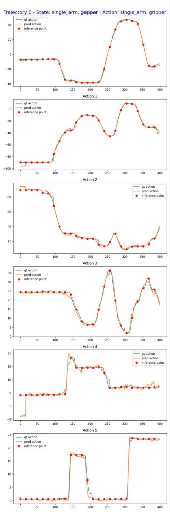

# Fine-tune on Custom Embodiments ("NEW_EMBODIMENT")

This guide demonstrates how to finetune GR00T on your own robot data and configuration. We provide a complete example for the Huggingface [SO-100](https://github.com/TheRobotStudio/SO-ARM100) robot under `examples/SO100`, which uses `demo_data/cube_to_bowl_5` as the demo dataset.

## Step 1: Prepare Your Data

Prepare your data in **GR00T-flavored LeRobot v2 format** by following the [data preparation guide](data_preparation.md). 

## Step 2: Prepare Your Modality Configuration

Define your own modality configuration by following the [modality config guide](data_config.md). Below is an example configuration that corresponds to the demo data:
```python
from gr00t.configs.data.embodiment_configs import register_modality_config
from gr00t.data.embodiment_tags import EmbodimentTag
from gr00t.data.types import (
    ActionConfig,
    ActionFormat,
    ActionRepresentation,
    ActionType,
    ModalityConfig,
)


so100_config = {
    # Video: use current frame only ([0]); list camera view names matching modality.json
    "video": ModalityConfig(
        delta_indices=[0],
        modality_keys=[
            "front",
            "wrist",
        ],
    ),
    # State: current proprioceptive reading; keys must match modality.json "state" entries
    "state": ModalityConfig(
        delta_indices=[0],
        modality_keys=[
            "single_arm",
            "gripper",
        ],
    ),
    # Action: 16-step prediction horizon; each key needs an ActionConfig
    "action": ModalityConfig(
        delta_indices=list(range(0, 16)),  # predict 16 future steps
        modality_keys=[
            "single_arm",
            "gripper",
        ],
        action_configs=[
            # single_arm: RELATIVE = delta from current state (better generalization)
            ActionConfig(
                rep=ActionRepresentation.RELATIVE,
                type=ActionType.NON_EEF,       # joint-space, not end-effector
                format=ActionFormat.DEFAULT,
            ),
            # gripper: ABSOLUTE = target position (binary open/close works better absolute)
            ActionConfig(
                rep=ActionRepresentation.ABSOLUTE,
                type=ActionType.NON_EEF,
                format=ActionFormat.DEFAULT,
            ),
        ],
    ),
    # Language: task instruction from annotation field in the dataset
    "language": ModalityConfig(
        delta_indices=[0],
        modality_keys=["annotation.human.task_description"],
    ),
}

# Important: always register under EmbodimentTag.NEW_EMBODIMENT for custom embodiments
register_modality_config(so100_config, embodiment_tag=EmbodimentTag.NEW_EMBODIMENT)
```

## Step 3: Run Fine-tuning


> ⚠️ **aarch64 users (Spark / Thor / Orin):** After running `install_deps.sh`, always
> activate the venv with `source .venv/bin/activate && source scripts/activate_<platform>.sh`
> (e.g. `activate_spark.sh`, `activate_thor.sh`, or `activate_orin.sh`)
> and invoke training with **plain `python`**, not `uv run python`. The latter will
> re-sync against the root `pyproject.toml` (which targets x86_64 Python 3.10) and
> destroy the platform-specific environment.

We'll use `gr00t/experiment/launch_finetune.py` as the entry point. Ensure that the uv environment is enabled before launching. You can do this by running the command `uv run bash <example_script_name>`.

### View Available Arguments
```bash
# Display all available arguments
uv run python gr00t/experiment/launch_finetune.py --help
```

### Execute Fine-tuning
```bash
# Configure for single GPU
export NUM_GPUS=1
CUDA_VISIBLE_DEVICES=0 uv run python \
    gr00t/experiment/launch_finetune.py \
    --base-model-path nvidia/GR00T-N1.7-3B \
    --dataset-path ./demo_data/cube_to_bowl_5 \
    --embodiment-tag NEW_EMBODIMENT \
    --modality-config-path examples/SO100/so100_config.py \
    --num-gpus $NUM_GPUS \
    --output-dir /tmp/so100 \
    --save-total-limit 5 \
    --save-steps 2000 \
    --max-steps 2000 \
    --use-wandb \
    --global-batch-size 32 \
    --color-jitter-params brightness 0.3 contrast 0.4 saturation 0.5 hue 0.08 \
    --dataloader-num-workers 4
```

### Key Parameters

| Parameter | Description |
|-----------|-------------|
| `--base-model-path` | Path to the pre-trained base model checkpoint |
| `--dataset-path` | Path to your training dataset |
| `--embodiment-tag` | Tag to identify your robot embodiment |
| `--modality-config-path` | Path to user-specified modality config (required only for `NEW_EMBODIMENT` tag) |
| `--output-dir` | Directory where checkpoints will be saved |
| `--save-steps` | Save checkpoint every N steps |
| `--max-steps` | Total number of training steps |
| `--use-wandb` | Enable Weights & Biases logging for experiment tracking |

> **Note:** Validation during fine-tuning is disabled by default (`eval_strategy="no"` in the training config). To enable periodic validation, pass `--eval-strategy steps --eval-steps 500` (runs validation every 500 steps) or `--eval-strategy epoch` (runs validation every epoch). You can also adjust `--eval-batch-size` (default: 2).

## Step 4: Open Loop Evaluation

After finetuning, evaluate the model's performance using open loop evaluation:
```bash
uv run python gr00t/eval/open_loop_eval.py \
    --dataset-path ./demo_data/cube_to_bowl_5 \
    --embodiment-tag NEW_EMBODIMENT \
    --model-path /tmp/so100/checkpoint-2000 \
    --traj-ids 0 \
    --action-horizon 16 \
    --steps 400 \
    --modality-keys single_arm gripper
```

### `open_loop_eval.py` Parameters

| Parameter | Default | Description |
|-----------|---------|-------------|
| `--dataset-path` | `demo_data/cube_to_bowl_5/` | Path to LeRobot-format dataset |
| `--embodiment-tag` | `new_embodiment` | Robot embodiment tag (case-insensitive) |
| `--model-path` | `None` | Path to checkpoint. If omitted, connects to a running server via `--host`/`--port` |
| `--traj-ids` | `[0]` | Episode indices to evaluate (space-separated, e.g., `0 1 2`) |
| `--action-horizon` | `16` | Action steps predicted per inference call |
| `--steps` | `200` | Max steps per trajectory (capped by actual trajectory length) |
| `--denoising-steps` | `4` | Diffusion denoising iterations |
| `--save-plot-path` | `None` | Directory to save GT-vs-predicted comparison plots |
| `--modality-keys` | `None` | Action keys to plot. If omitted, plots all action dimensions |
| `--host` / `--port` | `127.0.0.1` / `5555` | Server address when `--model-path` is omitted |

### Example Evaluation Result

The evaluation generates visualizations comparing predicted actions against ground truth trajectories:



## Interpreting the Result: Is My Fine-tune Working?

`open_loop_eval.py` logs `Average MSE across all trajs` and `Average MAE across all trajs` (unnormalized action error; referred to below as `Average MSE`/`MAE`) and saves a ground-truth-vs-predicted plot. Unlike the simulation benchmarks (LIBERO, SimplerEnv, DROID), this tutorial intentionally does **not** publish a single target MSE: the demo set is only 5 episodes and your own dataset and task will differ, so a fixed number would not transfer and could mislead. Use these checks instead, in order:

1. **Plot overlap on a training trajectory (primary).** `--traj-ids 0` is part of the training set, so a model that has fit the data should track the ground-truth curves closely. Flat or constant predictions, or curves that ignore the GT shape, point to a setup problem rather than merely an under-trained model.
2. **Error decreases with training (reproducible trend).** Save intermediate checkpoints (e.g. add `--save-steps 500`) and run the eval on each. `Average MSE`/`MAE` on `traj 0` should fall steadily as steps increase. A flat or rising curve means training is not learning from your data.
3. **Record your own baseline.** Note the `Average MSE`/`MAE` from your first clean run on the unmodified `cube_to_bowl_5` command above, and treat it as your reference point. After you change dataset size, modality config, or hyper-parameters, re-run and compare against it.

For reference, one run of the command above — with `--save-steps` lowered to `500` so intermediate checkpoints are kept (1× H100, `--max-steps 2000`, eval on `--traj-ids 0`) — produced the trend below. The **shape** — error falling steadily as steps increase — is the signal; the absolute values are not a target and will differ with GPU, seed, and data.

| Checkpoint | `Average MSE` (traj 0) | `Average MAE` (traj 0) |
|-----------:|-----------------------:|-----------------------:|
| 500        | 87.5                   | 5.63                   |
| 1000       | 25.4                   | 3.30                   |
| 1500       | 13.2                   | 2.18                   |
| 2000       | 10.0                   | 1.76                   |

Averaged over all 5 training episodes, the final checkpoint scored `Average MSE` ≈ 7.5 / `Average MAE` ≈ 1.5.

When a run looks off, this table maps the common symptoms to causes that are operational (your setup) rather than a model bug:

| Symptom | Likely cause (operational, not a model bug) |
|---------|---------------------------------------------|
| MSE flat or rising across checkpoints | Learning rate too low, or data not loading — check `--dataset-path` and dataloader workers |
| Prediction curve is flat/constant | `modality.json` keys or `--modality-config-path` mismatch — action keys are not mapped |
| MSE extremely large or `NaN` (or `NaN` loss during training) | Action/state normalization — verify `meta/stats` and that action ranges are sane |
| Good on `traj 0` but poor on held-out episodes | Expected with only 5 demo episodes — this is data scarcity, not a bug |

> Establish this baseline on the **as-shipped** command before changing anything. Reproducing a known-good run first is the fastest way to separate setup mistakes from genuine issues when you scale to a larger dataset.
