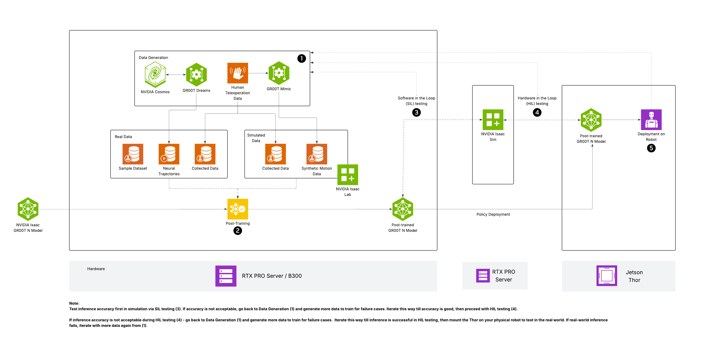

# Hardware Recommendations

GR00T N1.7 has two hardware profiles: **fine-tuning** (needs GPU VRAM and compute) and **inference/deployment** (needs low latency). This guide helps you choose the right hardware for each.

---

## Inference Hardware

**Minimum:** 1 GPU with 16 GB+ VRAM, CUDA 12.6+.

The table below summarizes end-to-end inference frequency across tested platforms (GR00T N1.7, 4 denoising steps, 1 camera):

| Platform | VRAM | PyTorch Eager | With TensorRT | Use Case |
|----------|------|---------------|---------------|----------|
| H100 80GB HBM3 | 80 GB | 11.7 Hz | 35.9 Hz | High-frequency control, multi-env batch inference |
| H20 96GB HBM3 | 96 GB | 12.0 Hz | 29.4 Hz | Cost-effective datacenter inference |
| RTX Pro 6000 Blackwell | 96 GB | 12.8 Hz | 35.9 Hz | Workstation inference, development |
| RTX Pro 5000 72GB | 72 GB | 7.9 Hz | 24.7 Hz | Workstation inference |
| L40 | 48 GB | 7.8 Hz | 26.0 Hz | Cloud inference |
| L20 | 48 GB | 7.1 Hz | 23.3 Hz | Cloud inference |
| DGX Spark | 128 GB shared | 7.9 Hz | 10.1 Hz | Desktop edge, prototyping |
| AGX Thor | 128 GB shared | 6.9 Hz | 10.7 Hz | Robot-mounted edge deployment |
| Orin* | 64 GB shared | 2.9 Hz | 4.6 Hz | Legacy Jetson edge |

> *Orin uses DiT-only TensorRT (TRT 10.3 does not support the backbone engine). All other platforms use the full TensorRT pipeline.

### Key Insights

- **30+ Hz** (H100, RTX Pro 6000 with TensorRT): suitable for high-frequency closed-loop control where sub-30 ms latency matters.
- **10+ Hz** (Thor, Spark with TRT; most dGPUs with torch.compile): sufficient for typical manipulation tasks running at a 10 Hz control rate.
- **< 5 Hz** (Orin): only suitable for slow, non-reactive tasks. Orin's TRT 10.3 cannot accelerate the backbone — gains are limited to DiT-only mode.
- **TensorRT Full Pipeline** provides 1.5--3.3x speedup over PyTorch Eager depending on platform. Biggest gains are on datacenter GPUs where backbone acceleration is significant.
- **torch.compile** is a good zero-effort middle ground (no engine build step), achieving 1.1--1.9x speedup across all platforms.

> For full per-component latency breakdown, see the [Deployment Benchmark Results](../scripts/deployment/README.md#benchmark-results).

---

## Fine-Tuning Hardware

**Minimum:** 1 GPU with 40 GB+ VRAM. GR00T N1.7 is a ~3B parameter model (bfloat16).

| Setup | GPUs | VRAM per GPU | Global Batch Size | Notes |
|-------|------|-------------|-------------------|-------|
| Quick start / prototyping | 1x H100, L40, or A100 | 40--80 GB | 32 | Single GPU; sufficient for demo datasets |
| Recommended | 4--8x H100 or L40 | 40--80 GB each | 64--640 | Multi-GPU via torchrun; faster convergence |
| Full scale | 8x RTX Pro 6000 or DGX | 96 GB each | 640 | Large datasets, production fine-tuning |

### Key Details

- **Default fine-tuning** tunes the projector + diffusion action head (not the full LLM backbone), keeping peak VRAM under ~35 GB per GPU.
- **Enabling `--tune-llm` or `--tune-visual`** significantly increases VRAM — 80 GB+ per GPU recommended.
- **`--gradient-accumulation-steps`** can compensate for fewer GPUs. For example, 4 GPUs with 8 accumulation steps and per-GPU batch of 8 gives an effective global batch size of 256.
- **Reduce `--num-shards-per-epoch`** if host memory (not VRAM) is limited — this controls how much dataset is preloaded into RAM.

---

## Software Requirements

| Requirement | Version |
|-------------|---------|
| Python | 3.10 |
| CUDA | 12.6+ (dGPU, Orin) / 13.0 (Thor, Spark) |
| PyTorch | 2.7+ |
| OS | Ubuntu 22.04+ (dGPU), JetPack 6.2 (Orin), Ubuntu 24.04 (Thor, Spark) |
| Package manager | [uv](https://docs.astral.sh/uv/) (recommended) |

Platform-specific installation instructions: see the [Deployment Guide](../scripts/deployment/README.md).

---

## Recommended Configurations

### Starter Kit

For development, small-scale fine-tuning, and edge deployment:

| Component | Recommendation |
|-----------|---------------|
| Training | 1--4x L40 (48 GB) or RTX Pro 5000/6000 workstation |
| Edge Deployment | [Jetson AGX Thor](https://developer.nvidia.com/embedded/jetson) Developer Kit (128 GB shared memory, Blackwell GPU) |
| Storage | 500 GB+ SSD (datasets + checkpoints) |

### Center of Excellence

For production fine-tuning and high-throughput inference:

| Component | Recommendation |
|-----------|---------------|
| Training | DGX with 8x H100/B200, or RTX Pro Server with 8x RTX Pro 6000 Blackwell |
| Inference Server | H100 or H20 node with TensorRT Full Pipeline (35+ Hz per GPU) |
| Edge Deployment | [Jetson AGX Thor](https://developer.nvidia.com/embedded/jetson) or [DGX Spark](https://developer.nvidia.com/dgx-spark) |
| Storage | Scalable networked storage (NFS/S3) for large-scale datasets |
